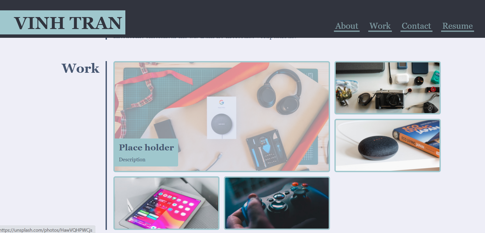
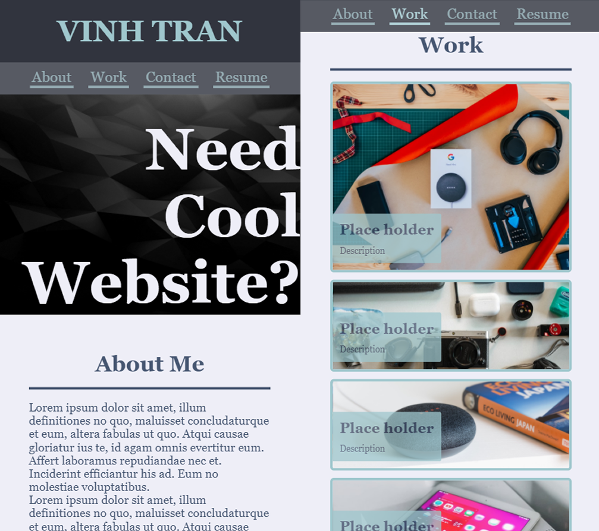

# Portfolio example

Working link: https://meemofu.github.io/portfolio-sample/

## Preview:

### Desktop mode:

### Mobile mode:

## Special features:

### Page header:
* 2 separate sticky header for desktop and mobile devices
* Mobile ver have the header fixed and only let navigator bar stick
* Navigation bar will jump to content with offset, preventing the header to overlap

### Pannels content:
* Clickable pannel for hyperlinks
* Easily expandable with customizable sizes (specicial item class to set image and sizing tag)
* Neat hover animation for desktop
* Simple display for mobile

## Development note:
External links like resume, contact info are currently '#' IDs for placeholder
